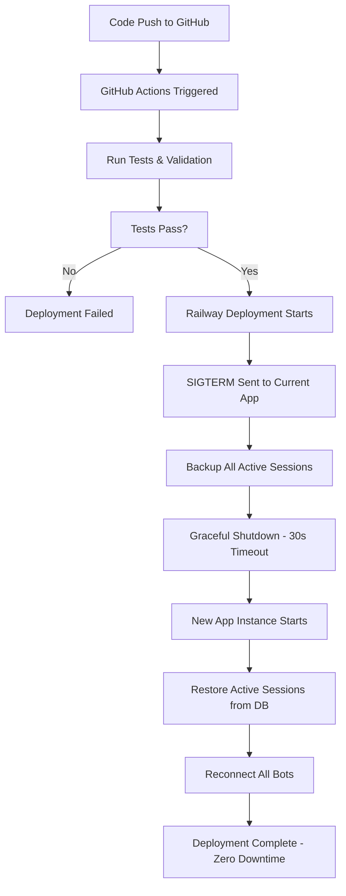

# 🚀 Seamless Auto-Deployment Guide

This guide explains how to set up seamless auto-deployment for your WhatsApp bot project on Railway, ensuring that existing bot sessions remain active during deployments without requiring users to logout and login again.

## 🎯 Overview

Your WhatsApp bot project now includes:
- **Automatic GitHub-to-Railway deployment**
- **Session persistence across deployments**
- **Graceful shutdown handling**
- **Zero-downtime bot operations**
- **Automatic session restoration**

## 🔧 How It Works

### 1. Session Backup System
- Bot sessions are automatically backed up every 30 seconds to MongoDB
- Active user sessions (userId, phoneNumber, connection status) are stored persistently
- Session data survives app restarts and deployments

### 2. Graceful Shutdown Process
- When a deployment is triggered, the app receives a SIGTERM signal
- All active sessions are immediately backed up to the database
- The app waits 5 seconds to ensure all data is saved
- Only then does the old instance shut down

### 3. Session Restoration
- When the new deployment starts, it automatically checks for active sessions
- All previously connected bots are restored from the database
- Users continue to receive messages without interruption
- No QR code scanning required for existing users

### 4. Auto-Deployment Pipeline
- Push code to GitHub (main/master branch)
- GitHub Actions runs validation tests
- Railway automatically deploys the new version
- Sessions are preserved throughout the process

## 📁 Key Files & Configuration

### Railway Configuration (`railway.toml`)
```toml
[deploy]
startCommand = "npm start"
restartPolicyType = "ON_FAILURE"
restartPolicyMaxRetries = 10
healthcheckPath = "/health"
healthcheckTimeout = 300
gracefulShutdownTimeout = 30  # Allows time for session backup

[deployment]
source = "github"
autoRedeploy = true
branch = "main"
buildCommand = "npm install"
startCommand = "npm start"
watchPaths = ["*.js", "*.json", "package.json", "!node_modules/**"]
```

### GitHub Actions Workflow (`.github/workflows/auto-deploy.yml`)
- Runs tests before deployment
- Validates deployment configuration
- Provides deployment status feedback
- Includes post-deployment health checks

### Database Schema (`database.js`)
New `ActiveSession` collection stores:
- `userId`: Unique bot identifier
- `userName`: User's display name
- `phoneNumber`: WhatsApp phone number
- `isReady`: Connection status
- `lastBackup`: Timestamp of last backup

### Multi-Bot Manager (`multi-bot-manager.js`)
Enhanced with:
- `startSessionBackup()`: Continuous session backup
- `restoreActiveSessions()`: Recovery on startup
- `gracefulShutdownForDeployment()`: Clean shutdown process
- `setupGracefulShutdown()`: Signal handling

## 🚀 Setup Instructions

### 1. Connect Repository to Railway
1. Go to [Railway Dashboard](https://railway.app/dashboard)
2. Click "New Project" → "Deploy from GitHub repo"
3. Select your WhatsApp bot repository
4. Railway will automatically detect the configuration

### 2. Configure Environment Variables
Set these in Railway dashboard:
```
MONGODB_URI=your-mongodb-connection-string
PORT=3000
NODE_ENV=production
```

### 3. Enable Auto-Deployment
1. In Railway project settings, go to "GitHub"
2. Ensure "Auto-Deploy" is enabled
3. Set branch to "main" or "master"
4. Configure deployment triggers

### 4. Test the Setup
1. Make a small code change
2. Push to your main branch
3. Watch Railway automatically deploy
4. Verify existing bot sessions remain active

## 📊 Monitoring & Health Checks

### Health Endpoint
Your app exposes a health check at `/health`:
```json
{
  "status": "healthy",
  "timestamp": "2025-01-06T14:30:00.000Z",
  "activeBots": 5,
  "uptime": 3600
}
```

### Session Monitoring
Monitor active sessions via database or add API endpoints:
- Total active bots
- Recent session backups
- Deployment history
- Connection status

## 🔄 Deployment Process Flow



## 🛠️ Troubleshooting

### Session Not Restored
**Symptoms**: Bot requires QR scan after deployment
**Solutions**:
1. Check MongoDB connection in logs
2. Verify `updateActiveUserSessions()` is being called
3. Ensure session backup interval is running
4. Check if graceful shutdown completed

### Deployment Fails
**Symptoms**: Railway deployment shows error
**Solutions**:
1. Check GitHub Actions logs for test failures
2. Verify `npm test` passes locally
3. Check Railway build logs
4. Ensure all environment variables are set

### Health Check Fails
**Symptoms**: Railway shows service as unhealthy
**Solutions**:
1. Verify `/health` endpoint responds
2. Check MongoDB connection status
3. Ensure server starts on correct port
4. Review application logs for errors

## 📈 Best Practices

### 1. Regular Testing
- Test deployments in a staging environment first
- Verify session persistence with actual users
- Monitor deployment success rates

### 2. Database Maintenance
- Regularly clean up old session backups
- Monitor database performance
- Set up database backups

### 3. Monitoring
- Set up alerts for deployment failures
- Monitor bot connection rates
- Track session restoration success

### 4. Documentation
- Keep deployment logs
- Document any custom configurations
- Track user feedback on deployment experience

## 🔐 Security Considerations

### Environment Variables
- Never commit sensitive data to repository
- Use Railway's secure environment variable storage
- Rotate database credentials regularly

### Session Data
- Session backups contain phone numbers
- Ensure MongoDB access is restricted
- Consider encrypting sensitive session data

## 📞 Support

If you encounter issues:
1. Check Railway deployment logs
2. Review GitHub Actions workflow results
3. Monitor MongoDB for session backup data
4. Test locally with `npm start`

## 🎉 Success Indicators

Your seamless deployment is working when:
- ✅ Code pushes trigger automatic deployments
- ✅ Existing bot users never see disconnections
- ✅ No QR code rescanning required after deployments
- ✅ Health checks remain green during deployments
- ✅ Session restoration logs show successful reconnections

---

**🚀 Your WhatsApp bot now supports true zero-downtime deployments with session persistence!**

Users will experience seamless service continuity while you can deploy updates confidently without worrying about disrupting active bot sessions.
